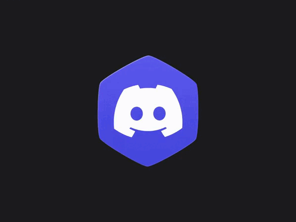

<p align="center">
    
</p>

**StepLauncher** es el **launcher definitivo para Minecraft Java Edition**, construido totalmente en **TypeScript** y **Electron**. Es compatible actualmente con **Windows** y **Linux**, y muy pronto también con **MacOS**.

Es el **primer launcher** que utiliza nuestro propio paquete **Minecraft-Core-Master**, diseñado para ofrecer **descarga, ejecución y gestión de mods y loaders** de manera integrada y sencilla.

## Características principales

* Compatibilidad total con **Windows, Linux** y próximamente **MacOS**.
* Soporte para loaders populares: **Forge, NeoForge, Fabric, LegacyFabric, Optifine, Quilt**, entre otros.
* Integración con **CurseForge** y **Modrinth** para descargar **mods, shaders y texture packs, etc...** desde un solo lugar.
* Gestión de **instancias y perfiles separados**, con mods y configuraciones independientes para cada uno.
* Descarga y juega desde la **versión más antigua** de Minecraft hasta la más reciente.
* Inicio de sesión con **Microsoft** y soporte para cuentas **NoPremium**.
* Basado en nuestro paquete **Minecraft-Core-Master**, que mejora constantemente gracias a la comunidad.
* [Parametros de Lanzamiento](./docs/images/parameters.md) que son opcionales para el usuario pero que dan mas accesibilidad al usuario al iniciar **StepLauncher**

## Comunidad y soporte

Estamos muy atentos a la comunidad. Únete a nuestro **Discord de NovaStepStudios** para:

* Acceder a **releases tempranas y novedades**.
* Proponer mejoras y dar feedback sobre StepLauncher y Minecraft-Core-Master.
* Intercambiar opiniones y aprender junto a otros Minecrafters.

Creemos en un launcher **hecho por la comunidad, para la comunidad**, donde cada opinión cuenta.

<p align="center">
  
  <p align="center">
    <a href="https://discord.gg/YAqpTWQByM" target="_blank">
      
    </a>
  </p>
</p>

## Por qué StepLauncher es único

* Combina todas las funciones que un launcher moderno necesita en un solo lugar.
* Soporte avanzado para mods y loaders con integración directa a las plataformas más populares.
* Interfaz intuitiva, rapidez, estabilidad y profesional gracias a **Electron y TypeScript**.
* Actualizaciones constantes basadas en feedback de jugadores o usuarios.
* Recoleccion de errores y lo unifica en un archivo **Log** detallado para luego avisar o enviar a **NovaStepStudios** Alias **Stepnicka** para arreglar el fallo que a tenido **StepLauncher**

## Tecnologías Utilizadas

**StepLauncher** está construido sobre un stack moderno que garantiza estabilidad, rendimiento y compatibilidad.

## Principales Tecnologías

| Función                   | Tecnología           | Enlace                                                                               |
| ------------------------- | -------------------- | ------------------------------------------------------------------------------------ |
| Lenguaje de programación  | **TypeScript**       | [npmjs.com/package/typescript](https://www.npmjs.com/package/typescript)             |
| Framework de ventanas     | **Electron**         | [npmjs.com/package/electron](https://www.npmjs.com/package/electron)                 |
| Compilador / empaquetador | **Electron-Builder** | [npmjs.com/package/electron-builder](https://www.npmjs.com/package/electron-builder) |

## Paquetes Principales

* [minecraft-core-master](https://www.npmjs.com/package/minecraft-core-master) – manejo completo de descargas, mods y loaders.
* [adm-zip](https://www.npmjs.com/package/adm-zip) – manipulación de archivos ZIP.
* [unzipper](https://www.npmjs.com/package/unzipper) – extracción de archivos ZIP.

# Instalación

Para instalar **StepLauncher**, puedes elegir entre descargar una versión lista desde **Releases** en GitHub o desde nuestra página oficial: [StepLauncher.web.app](https://steplauncher.web.app) | [StepLauncher.pages.dev](https://steplauncher.pages.dev).

StepLauncher es compatible con:

* **Windows:** de Windows 7 hasta Windows 11
* **Linux:** distribución general (Inlcuida Debian y similares)

## Instalación desde GitHub (Clonando el repositorio)

Si quieres **clonar el repositorio** y ejecutar StepLauncher desde código fuente, asegúrate de tener **Git** instalado y ejecuta los siguientes comandos en tu terminal:

```bash
# Clonar el repositorio
git clone https://github.com/NovaStepStudios/StepLauncher
cd StepLauncher

# Instalar dependencias
npm install

# Ejecutar en modo desarrollo
npm run dev
```